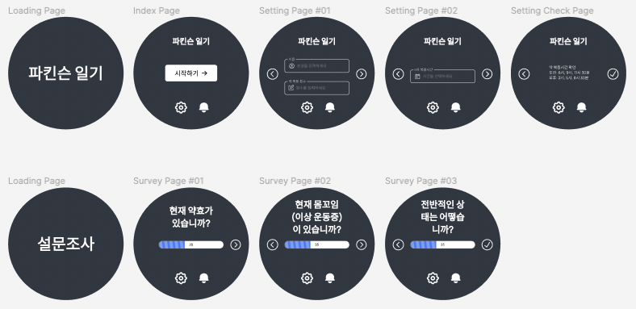
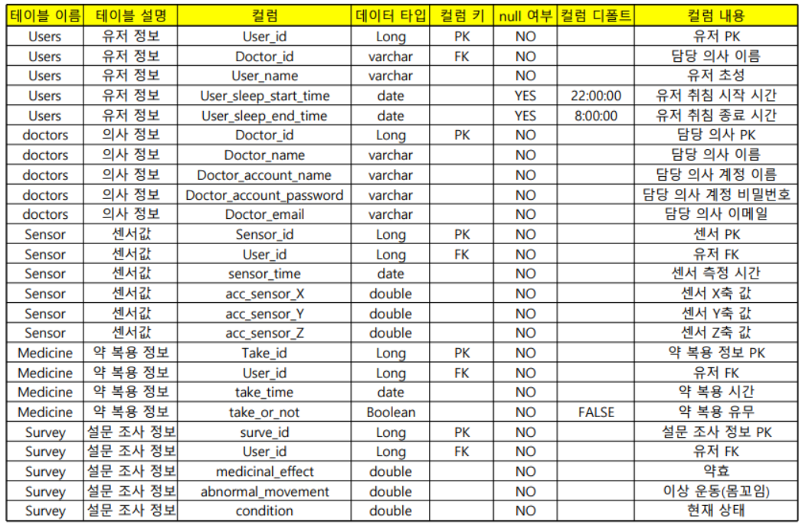
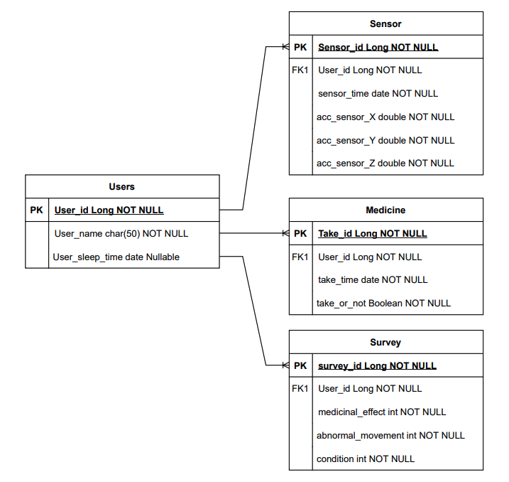

# ⌚️ Parkinson Diary(파킨슨 일기)

## 🖥 사용자 인터페이스(UI)

## ⚙️ 개발 환경(Development Environment)

| 분류 | 개발환경 | 
|---|---|
| 운영체제 | Windows 10 64bit / Mac OS |
| 개발도구 | Intellij IDEA, Android Studio, Gradle, Figma |
| 프레임워크 | Spring Boot 2.7.1, Express.js 4.16.4 |
| 데이터베이스 | MySQL (Release 8.0.29) |
| 버전 관리 | Github, Git |
| 배포 및 운영 | AWS EC2, AWS RDS, Docker |
| 오픈소스 및 외부 라이브러리 | Google Wear OS API |

## 🛠 세부 기술 스택(Tech Stack)

### 백엔드(Back-end)

#### 관리자 웹 사이트

- **Java 11**
- **Spring Boot 2.7.1**
	- Spring Web MVC
	- Spring Data JPA
	- Spring Security

#### API 서버

- **JavaScript**
- **Node.js**
  - Express.js

### 데이터베이스(Database)

- **MySQL (Release 8.0.29)**

### 프론트엔드(Front-end)

- **Thymeleaf**
- **Bootstrap**

### ETC

- 추가 예정

## 📝 도메인 모델 분석(Domain Model Analysis)

### 회원(User)

- 회원과 센서의 관계 : 회원은 여러 번의 움직임을 통해서 센서에 감지된다.(1:N)
- 회원과 약의 관계 : 회원은 여러 번 약을 복용할 수 있다.(1:N)
- 회원과 설문조사의 관계 : 회원은 설문조사를 여러 번 한다(30분에 한번씩 수행). (1:N)

### 센서(Sensor)

- 센서와 회원의 관계 : 센서는 한 사람의 움직임을 여러 번 감지한다. (N:1)

### 약(Medicine)

- 약과 회원의 관계 : 회원은 여러 번 약을 복용할 수 있다.(N:1)

### 설문조사(Survey)

- 회원과 설문조사의 관계 : 회원은 설문조사를 여러 번 한다(30분에 한번씩 수행). (N:1)

## 📝 테이블 정의서(Entity Details)

## 🔗 엔티티-관계 모델(Entity Relationship Diagram)

## 📐 트러블 슈팅(Trouble Shooting)

- 추가 예정
