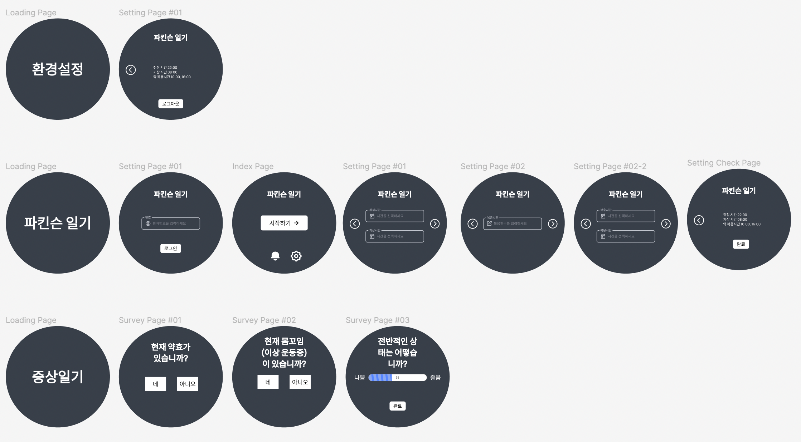
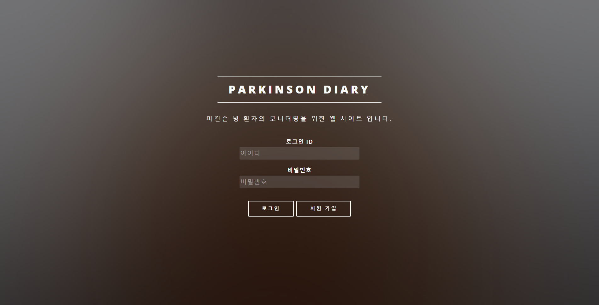
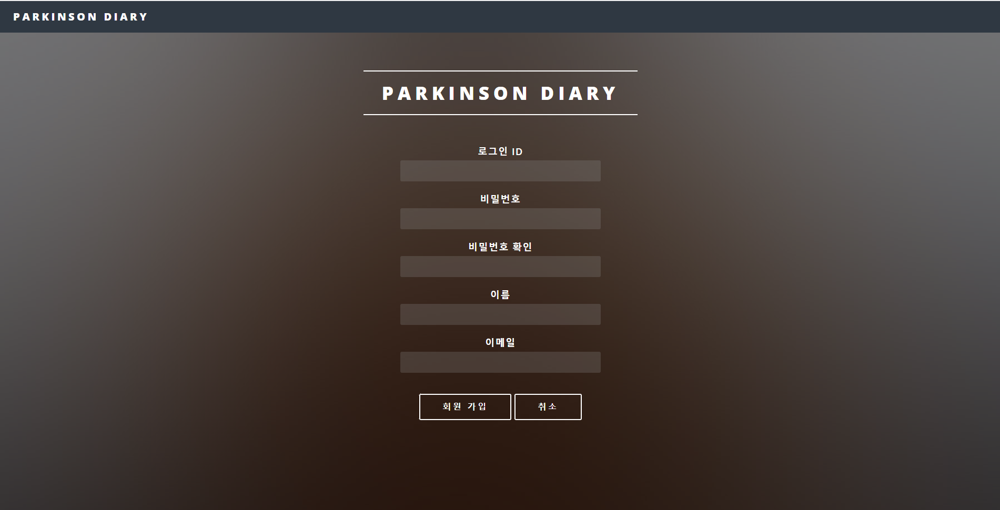
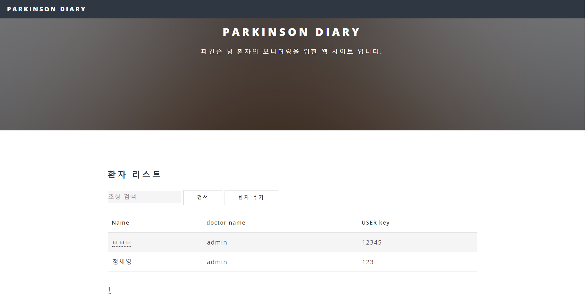
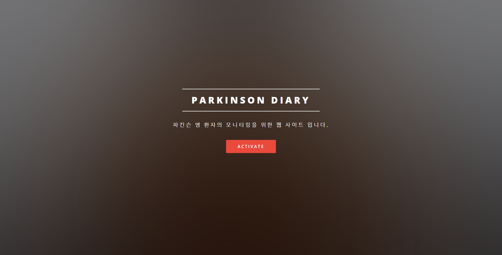
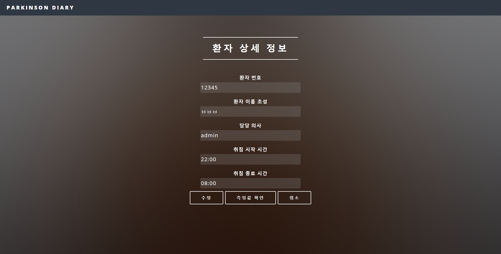
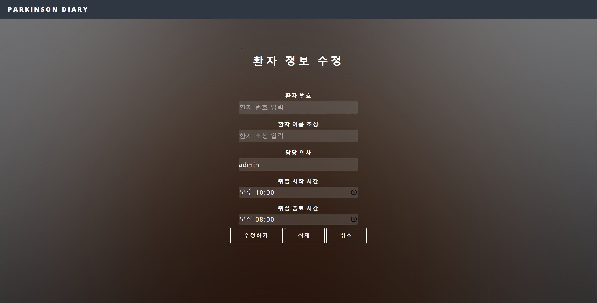
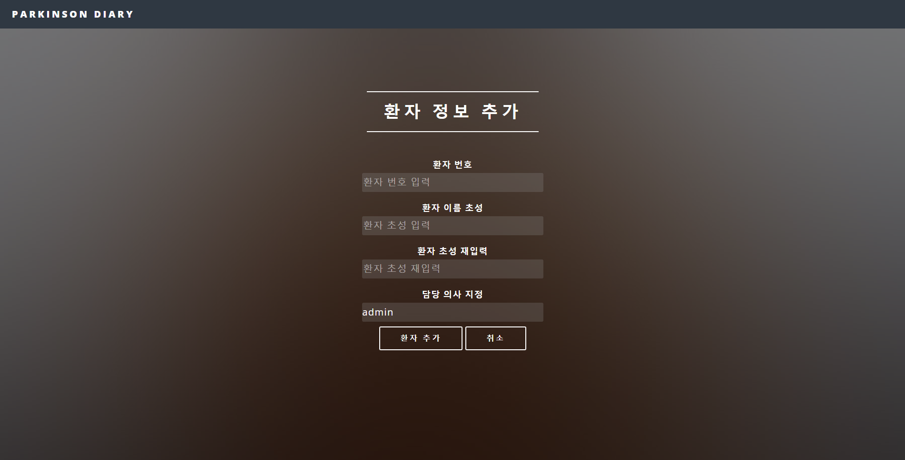
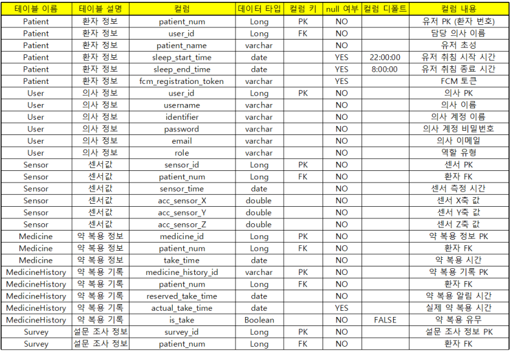
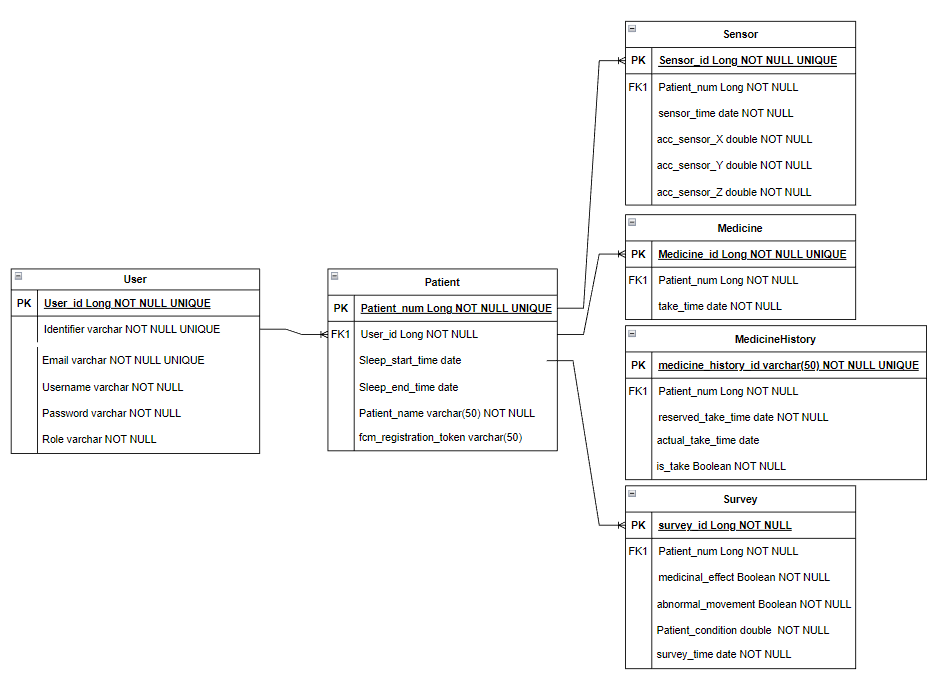

# ⌚️ Parkinson Diary(파킨슨 일기)

## 🖥 사용자 인터페이스(UI)

## 🖥 관리자 웹 인터페이스(UI)
### 로그인, 회원가입
 |
--- | --- | 
### 환자 리스트, 메인
 |
--- | --- | 
### 환자 상세 정보, 수정
 | |
--- | --- | --- |
### 환자 상세 그래프
 |
--- | --- | 

## 🔎 기능(function)
### ⌚️ 갤럭시 워치 기능
1. 환경 설정
	1. 약 복용 시간 설정
	2. 수면 시간 설정
	3. 설문 시간 간격 설정
2. 초기 세팅
	1. 담당 교수 선택
	2. 이름 및 약 복용 횟수 입력
	3. 약 복용 시간 입력
   	4. 세팅 확인
3. 설문조사
	1. 현재 약효 설문
	2. 이상 운동증 설문
	3. 전반적인 상태 설문
### 🖥 관리자 웹 사이트 기능
1. 회원 가입(관리자)
2. 로그인(관리자)
3. 환자 리스트 조회
	1. 초성을 통한 환자 검색
	2. 환자 이름을 선택하여 상세 정보 조회
	3. 상세 정보 수정
   	4. 설문조사 결과 확인
	5. 환자 추가

## ⚙️ 개발 환경(Development Environment)

| 분류 | 개발환경 | 
|---|---|
| 운영체제 | Windows 10 64bit / Mac OS |
| 개발도구 | Intellij IDEA, Android Studio, Gradle, Figma |
| 프레임워크 | Spring Boot 2.7.1, Express.js 4.16.4 |
| 데이터베이스 | MySQL (Release 8.0.29) |
| 버전 관리 | Github, Git |
| 배포 및 운영 | AWS EC2, AWS RDS, Docker |
| 오픈소스 및 외부 라이브러리 | Google Wear OS API |

## 🛠 세부 기술 스택(Tech Stack)

### 백엔드(Back-end)

#### 관리자 웹 사이트

- **Java 11**
- **Spring Boot 2.7.1**
	- Spring Web MVC
	- Spring Data JPA
	- Spring Security

#### API 서버

- **JavaScript**
- **Node.js**
  - Express.js

### 데이터베이스(Database)

- **MySQL (Release 8.0.29)**

### 프론트엔드(Front-end)

- **Thymeleaf**
- **Bootstrap**

### ETC

- 추가 예정

## 📝 도메인 모델 분석(Domain Model Analysis)

### 회원(User)

- 회원과 센서의 관계 : 회원은 여러 번의 움직임을 통해서 센서에 감지된다.(1:N)
- 회원과 약의 관계 : 회원은 여러 번 약을 복용할 수 있다.(1:N)
- 회원과 설문조사의 관계 : 회원은 설문조사를 여러 번 한다(30분에 한번씩 수행). (1:N)

### 센서(Sensor)

- 센서와 회원의 관계 : 센서는 한 사람의 움직임을 여러 번 감지한다. (N:1)

### 약(Medicine)

- 약과 회원의 관계 : 회원은 여러 번 약을 복용할 수 있다.(N:1)

### 설문조사(Survey)

- 회원과 설문조사의 관계 : 회원은 설문조사를 여러 번 한다(30분에 한번씩 수행). (N:1)

## 📝 테이블 정의서(Entity Details)

## 🔗 엔티티-관계 모델(Entity Relationship Diagram)

## 📐 트러블 슈팅(Trouble Shooting)

- 추가 예정
